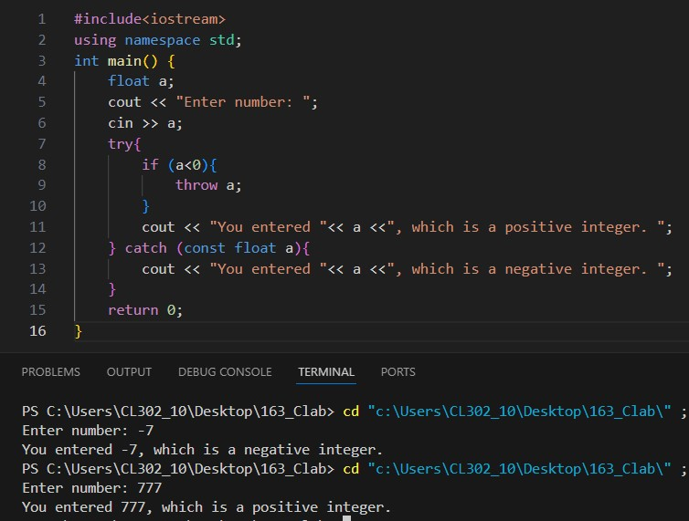
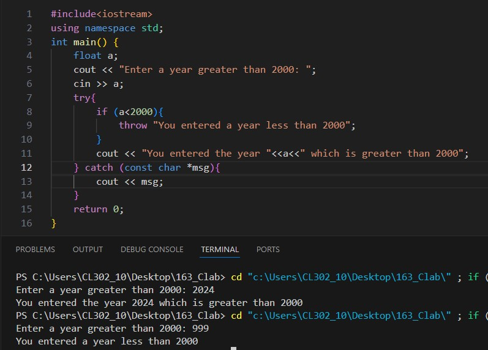

# Experiment 16
## Theory:
Exceptions are runtime anomalies or abnormal conditions that a program encounters during its execution. Exception handling in C++ is a mechanism that allows a program to deal with unexpected or exceptional situations (such as runtime errors) in a structured way, ensuring that the program can continue functioning or terminate gracefully. 
### C++ provides the following specialized keywords for this purpose:
###
`try`: Represents a block of code that can throw an exception.
###
`catch`: Represents a block of code that is executed when a particular exception is thrown.
###
`throw`: Used to throw an exception.
###
1.  When an exception is detected, control is transferred to the `throw` statement.
2.  The `throw` statement jumps to the appropriate `catch` block that handles the type of exception.
3.  Once caught, the `catch` block executes, after which the program can either recover or terminate based on the logic implemented.

## Program 1
### Aim: 
Prompt the user to enter a positive number. If the user enters a positive number, display that number. If the user enters a negative number throw an exception.
### Software used: 
Visual Studio Code
### Output:

### Conclusion:
We applied exception handling in C++ to check whether a negative or positive integer. 

## Program 2
### Aim: 
Prompt the user to enter a year greater than 2000. If the user enters the year greater than 2000, then display that year. If the user enters a year less than 2000 throw an exception.
### Software used: 
Visual Studio Code
### Output:

### Conclusion:
We applied exception handling in C++ to check whether the entered year belongs to the 21st century or not. 
